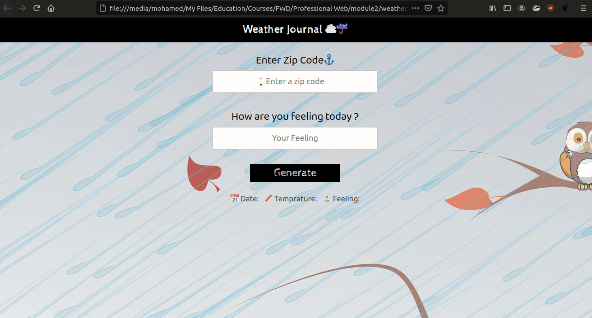

# Task 1 [Web Fundamentals]
## Details
### Search the following topics and learn about them in your way

#### What is a
    - asynchronous js (callbacks,promises, aync await)[vey important]
    - IP address
    - Server
    - Client-side
    - Server-side
    - JSON
    - HTTP 
    - Library vs Framework
    - CRUD Operations
    - API
    - Client Side/ Server Side Routing
    - SPA (Single Page Applications)[optional]
    - REST API [optional]
    - SQL vs No SQL Databases [optional]

##### Async material : [playlist](https://www.youtube.com/playlist?list=PL4cUxeGkcC9jx2TTZk3IGWKSbtugYdrlu)

### Implement the Following Aplication Using the concepts you have learned

**Weather App by ZIP code**

You are required to build a weather app that fetches weather information of different 
regions in US and show these weather information to the user depending on the input
ZIP code.

- The data are fetched from Open Weather API (Make your own credentials and use their API)
- You have to print the JSON object fetched from the OpenWeather to the console for every
time the user requests weather data.

